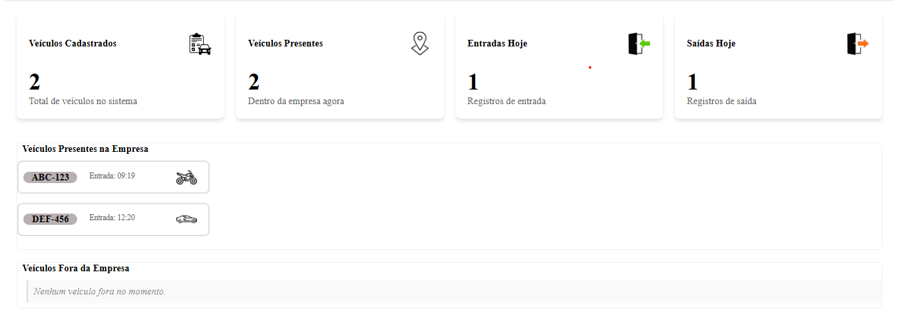
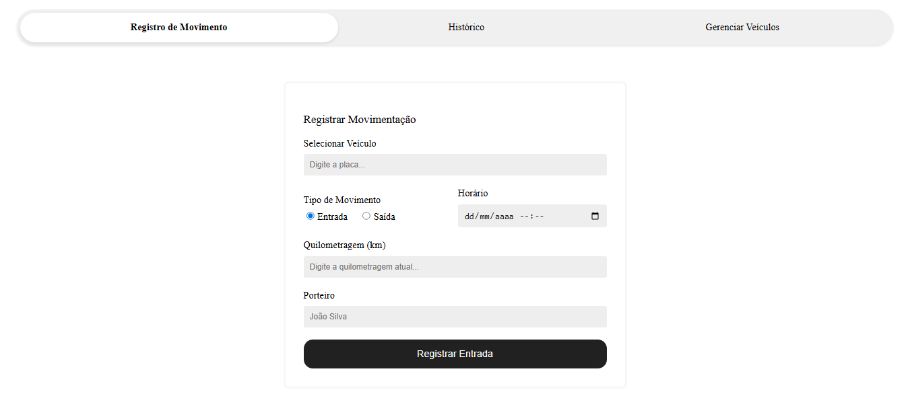
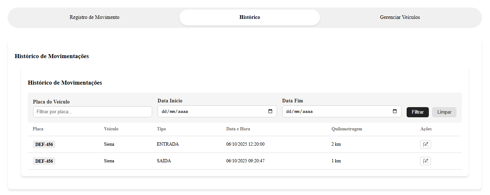
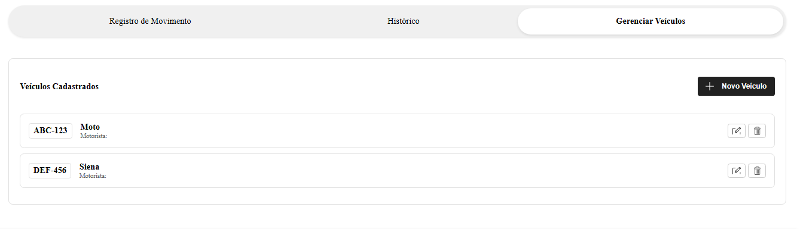
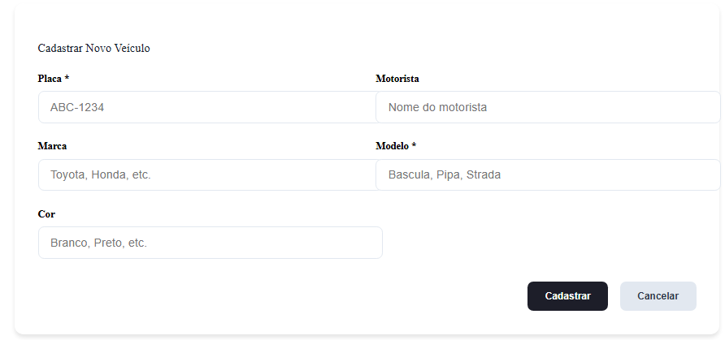
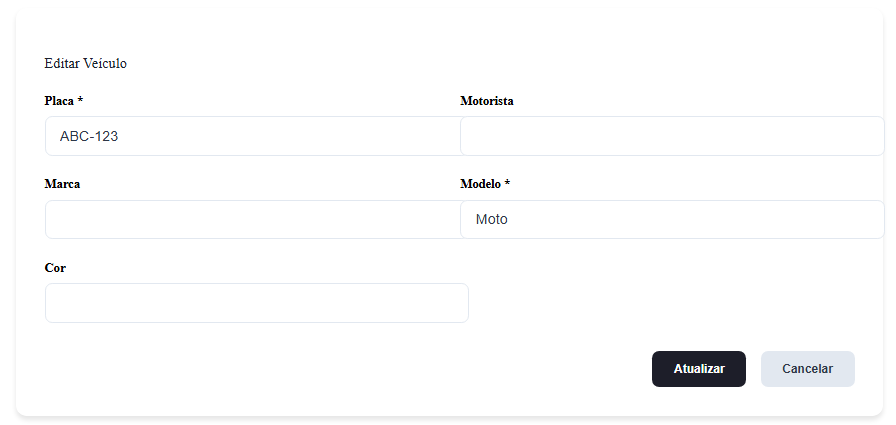
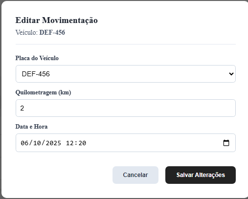

# 🚗 Sistema de Controle de Portaria e Quilometragem


## 📄 Descrição

Este é um sistema web full-stack desenvolvido para automatizar e digitalizar o controle de entrada e saída de veículos de uma empresa. A aplicação substitui o processo manual de anotação em planilhas, fornecendo um registro centralizado, em tempo real, com histórico consultável e relatórios, otimizando a agilidade da portaria e a precisão dos dados para a gestão da frota.

---

## ✨ Funcionalidades Principais

-   **🖥️ Dashboard em Tempo Real:** Cards dinâmicos que mostram o total de veículos cadastrados, veículos presentes na empresa, e o número de entradas e saídas registradas no dia.
-   **➡️ Registro de Movimentação:** Formulário inteligente para o operador da portaria registrar entradas e saídas. Inclui uma busca de veículos por placa (autocomplete) e lógica de correção automática para registros inconsistentes.
-   **🚚 Gestão de Veículos:** Interface CRUD (Criar, Ler, Atualizar, Deletar) completa para o cadastro e gerenciamento dos veículos da frota.
-   **📜 Histórico Completo:** Tabela com todas as movimentações já registradas, com sistema de paginação para lidar com grandes volumes de dados de forma eficiente.
-   **✏️ Edição de Registros:** Possibilidade de editar movimentações diretamente do histórico para corrigir erros de digitação (ex: quilometragem ou horário).
-   **🔍 Filtro Avançado:** A tela de histórico permite filtrar os registros por placa do veículo e/ou por um intervalo de datas.

---

## 🛠️ Tecnologias Utilizadas

**Back-end:**
-   
-   
-   
-   
-    (ou PostgreSQL)

**Front-end:**
-   
-   
-   
-   

**Documentação da API:**
-   

---

## 📸 Screenshots

**[LEMBRETE: Substitua os links abaixo por screenshots reais do seu projeto com DADOS FICTÍCIOS]**

#### Dashboard Principal


---

#### Registro de Movimentação


---

#### Histórico com Filtro e Paginação


---

#### Gestão de Veículos 


---

#### Cadastro de veículo


---

#### Modal de Edição Veículo

---


#### Modal de Edição Histórico

---


## 🚀 Como Executar o Projeto Localmente

**Pré-requisitos:**
-   Java 17+
-   Maven 3.8+
-   Node.js 18+
-   Angular CLI 17+
-   Um servidor de banco de dados MySQL (ou PostgreSQL) rodando.

### Back-end (API)

1.  **Clone o repositório:**
    ```bash
    git clone [URL_DO_SEU_REPOSITORIO]
    ```

2.  **Configure o banco de dados:**
    - Crie um banco de dados no seu MySQL (ex: `controle_veiculos_db`).
    - Navegue até a pasta do back-end.
    - Abra o arquivo `src/main/resources/application.properties`.
    - Configure as suas credenciais do banco de dados:
      ```properties
      spring.datasource.url=jdbc:mysql://localhost:3306/controle_veiculos_db
      spring.datasource.username=seu_usuario
      spring.datasource.password=sua_senha
      spring.jpa.hibernate.ddl-auto=update
      ```

3.  **Execute a aplicação:**
    - Ainda na pasta do back-end, execute o comando:
      ```bash
      mvn spring-boot:run
      ```
    - A API estará disponível em `http://localhost:8080`.

### Front-end (Interface)

1.  **Navegue até a pasta do front-end:**
    ```bash
    cd controle-veiculo-app 
    ```

2.  **Instale as dependências:**
    ```bash
    npm install
    ```

3.  **Execute a aplicação:**
    ```bash
    ng serve
    ```
    - Acesse a aplicação em seu navegador no endereço `http://localhost:4200`.

---

## 👨‍💻 Autor

Feito por Victor Emanuel Galvão dos Santos